<h3><code>altaf@github ~ $ ./contributions.sh</code></h3>

  
<h3><code>altaf@github ~ $ whoami</code></h3>
<table>
  <tr>
    <td valign="top"></td>
    <td valign="top"></td>
  </tr>
</table>

<!--
Every image above is an SVG generated by scripts/ — no third-party stats services.
The heatmap is refreshed daily by .github/workflows/update-profile-art.yml.
Portrait: pip install -r scripts/requirements-portrait.txt
          python scripts/prep_photo.py && python scripts/make_ascii_svg.py
Card:     python scripts/make_info_card.py
-->
